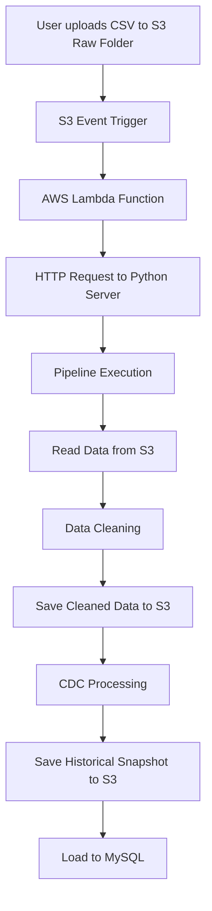

# 📦 S3 to MySQL CDC Data Pipeline

## 🚀 Overview
This project implements an **end-to-end data pipeline** that ingests CSV files from AWS S3, performs data cleaning, applies Change Data Capture (CDC), and loads the processed data into a MySQL database. It also maintains historical snapshots for tracking changes over time.

---

## 🎯 Key Features
- 📥 Automated ingestion from S3 (Raw Folder)
- 🧹 Data cleaning using Pandas
- 🔄 Change Data Capture (Insert, Update, Delete)
- 🗄️ MySQL data storage
- 📁 Historical snapshot management in S3
- ⚡ Event-driven pipeline using AWS S3 + Lambda

---

## 🏗️ Architecture Diagram



---

## ⚙️ Tech Stack
- **Python** (Pandas, SQLAlchemy, Boto3)
- **AWS S3** (Data storage)
- **AWS Lambda** (Event trigger)
- **MySQL** (Database)

---

## 📂 Folder Structure

```
S3 Bucket
│
├── Raw-Folder/          # Incoming raw CSV files
├── Cleaned-Data/        # Cleaned datasets
└── Historical-Data/     # CDC snapshots
```

---

## 🔄 Pipeline Workflow

### 1️⃣ File Upload
- User uploads CSV file to **S3 Raw Folder**

### 2️⃣ Event Trigger
- S3 triggers an event
- Lambda function is invoked automatically

### 3️⃣ API Call
- Lambda sends an HTTP request to the pipeline server

### 4️⃣ Data Processing
- Read file from S3
- Clean data:
  - Standardize column names
  - Remove duplicates
  - Convert data types

### 5️⃣ Change Data Capture (CDC)
- Identify:
  - 🟢 Inserts
  - 🟡 Updates
  - 🔴 Deletes

### 6️⃣ Data Storage
- Load latest data into MySQL
- Save cleaned data to S3
- Save historical snapshot to S3

---

## 🧠 CDC Logic Explained

| Operation | Description |
|----------|------------|
| Insert   | New records not present in old data |
| Update   | Existing records with modified values |
| Delete   | Records removed from new dataset |

---

## ▶️ How to Run

### 1. Install Dependencies
```
pip install boto3 pandas sqlalchemy mysql-connector-python
```

### 2. Configure Credentials
- AWS credentials
- MySQL connection details

### 3. Run Pipeline
```
python pipeline.py
```

---

## 🔐 Security Recommendations
- ❌ Do not hardcode AWS credentials
- ✅ Use IAM roles or environment variables
- ✅ Use AWS Secrets Manager for DB credentials

---

## 📈 Future Enhancements
- Use Apache Airflow for orchestration
- Implement incremental loading (avoid full replace)
- Add logging & monitoring (CloudWatch)
- Add data validation checks

---

## 👨‍💻 Author
**Vansh Raj Chauhan**

---
